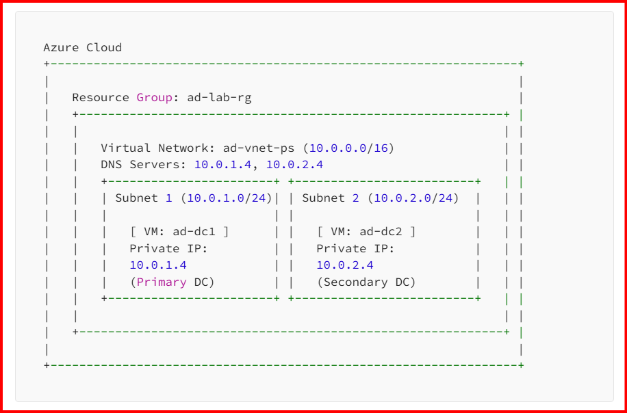

# PowerShell Script for Automated, Fault-Tolerant Active Directory Deployment in Azure

This repository contains an advanced PowerShell script that fully automates the deployment of a highly available, two-node Microsoft Active Directory (AD) environment in Microsoft Azure.

The script is designed to be robust, reusable, and easy to use, handling everything from network creation to the final AD configuration with built-in error handling and progress reporting.

## Features

-   **End-to-End Automation**: Creates the entire environment with a single command.
-   **High Availability**: Deploys two domain controllers in separate subnets to ensure fault tolerance.
-   **Advanced PowerShell Function**: Wrapped in a well-documented advanced function that supports common parameters like `-Verbose`, `-WhatIf`, and `-Confirm`.
-   **Customizable**: Key settings like resource group name, location, domain name, and VM size are parameterized for flexibility.
-   **Robust Error Handling**: Uses `try...catch` blocks to gracefully handle failures and provide clear error messages.
-   **Detailed Progress Reporting**: Provides real-time feedback on the deployment progress using `Write-Progress` and `Write-Verbose`.
-   **Best Practices**: Automatically configures the Virtual Network's DNS to point to the new domain controllers, a critical step for domain-joined resources.

---

## Architecture Deployed

The script provisions the following Azure resources:

-   A **Resource Group** to contain all the created resources.
-   A **Virtual Network (VNet)** with a `/16` address space.
-   Two **/24 Subnets** within the VNet, one for each domain controller.
-   A **Network Security Group (NSG)** with rules to:
    -   Allow RDP traffic from the internet for management.
    -   Allow all traffic within the VNet for replication and communication.
-   Two **Windows Server 2019 Virtual Machines** to act as domain controllers.
-   Two **Public IP Addresses** (one for each VM) for initial access.
-   Two **Network Interfaces** (one for each VM).



---

## Prerequisites

Before running this script, ensure you have the following:

1.  **An Azure Subscription**: You need an active Azure account with permissions to create resources.
2.  **Azure PowerShell Az Module**: The script requires the Az module to be installed. You can install it by running the following command in an elevated PowerShell session:
    ```powershell
    Install-Module -Name Az -Scope AllUsers -Repository PSGallery -Force
    ```
3.  **Connected Azure Account**: You must be logged into your Azure account. Run `Connect-AzAccount` to sign in.

---

## How to Use

1.  **Save the Script**: Save/Clone the script from the github repo as a `.ps1` file (e.g., `Deploy-ADInAzure.ps1`).

2.  **Open PowerShell**: Navigate to the directory where you saved the file.

3.  **Run the Script**: Execute the script. It will prompt you for a password that will be used for the local administrator account on the VMs and for the Directory Services Restore Mode (DSRM) password.

    ```powershell
    # Example usage:
    .\Deploy-ADInAzure.ps1
    ```

    A credential window will pop up. Enter a strong password to be used for the deployment.

    While the script runs out-of-the-box with sensible defaults, you can easily customize it using parameters.

    ```powershell
    # You'll be prompted for the password`
    .\Deploy-ADInAzure.ps1 -ResourceGroupName "Prod-AD-RG" -Location "West Europe" -DomainName "mycompany.corp" -VmSize "Standard_D4s_v5" -Verbose
    ```

    Using the `-Verbose` switch is highly recommended to see detailed step-by-step actions as the script runs.

4.  **Monitor Deployment**: The script will provide verbose output and progress bars as it creates the resources and configures the domain controllers. The entire process can take 20-30 minutes.

---

## Parameters Explained

The `New-AzFaultTolerantAD` function accepts the following parameters:

| Parameter           | Description                                                                                             | Default Value | Required |
| ------------------- | ------------------------------------------------------------------------------------------------------- | ------------- | -------- |
| `ResourceGroupName` | The name of the resource group to create.                                                               | `ad-lab-rg`   | No       |
| `Location`          | The Azure region where the resources will be deployed.                                                  | `East US`     | No       |
| `DomainName`        | The fully qualified domain name for the new AD forest.                                                  | `mylab.local` | No       |
| `Credential`        | A `PSCredential` object for the local VM admin. The script prompts for this if not provided.              | *(Prompt)* | Yes      |
| `VmSize`            | The Azure VM size for the domain controllers.                                                           | `Standard_D2s_v5` | No       |

## Customizing Your Deployment

While the script runs out-of-the-box with sensible defaults, you can easily customize it using parameters.

```powershell
# You'll be prompted for the password`
.\Deploy-ADInAzure.ps1 -ResourceGroupName "Prod-AD-RG" -Location "West Europe" -DomainName "mycompany.corp" -VmSize "Standard_D4s_v5" -Verbose
```

Using the `-Verbose` switch is highly recommended to see detailed step-by-step actions as the script runs.

---

## Post-Deployment

Once the script completes, it will output the public IP addresses of the two domain controllers.

-   You can use these IPs to **RDP** into the virtual machines using the username and password you provided.
-   It can take an additional 5-10 minutes after the script finishes for the second domain controller (DC2) to fully complete its replication and reboot cycle.
-   You can verify the health of the Active Directory replication by logging into one of the DCs and running `repadmin /replsum` in PowerShell or Command Prompt.

---

## Troubleshooting

-   **`securityProfile.securityType is invalid` Error**: This error indicates that the standard security type is a preview feature in your region and needs to be enabled for your subscription. Run the following Azure CLI command to register the feature flag:
    ```bash
    az feature register --name UseStandardSecurityType --namespace Microsoft.Compute
    ```
    Feature registration can take some time. You can check the status with `az feature show`.

-   **Null-Valued Expression Error**: This typically happens if the `Get-Credential` prompt is canceled. The script now includes a check to prevent this, but if it occurs, ensure you are providing a password at the prompt.

-   **Timeouts**: The script includes a 2-minute `Start-Sleep` to allow the first domain controller to reboot and stabilize. On rare occasions (depending on Azure's load), this might not be enough time. If the DC2 configuration fails because it can't contact DC1, you may need to increase this sleep duration.
